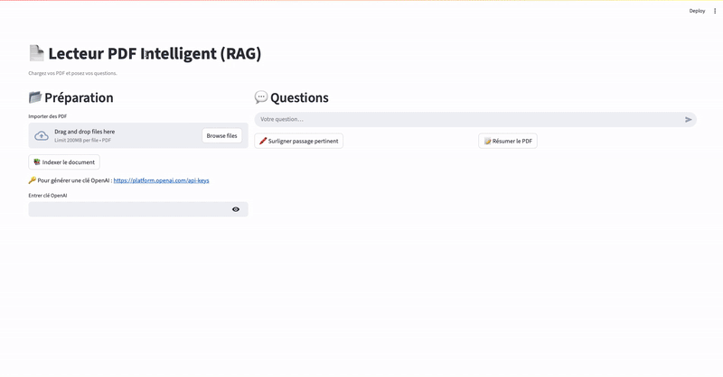

# 📘 RAG PDF App (Streamlit)

Application **Question/Réponse sur PDF** basée sur **LLMs OpenAI**, développée avec **Streamlit**.  
Elle permet de :  
- Importer un PDF et créer un index local (RAG)  
- Poser des questions en langage naturel sur le PDF  
- Générer un résumé du PDF  
- Mettre en évidence les passages pertinents liés à la réponse 
- Utiliser une clé OpenAI via saisie directe dans l’interface

---


## 📸 Aperçu de l’application



---

## 📁 Structure du projet
```bash
rag-pdf-app/
│
├── app.py                # Interface Streamlit
├── src/
│   ├── utils.py          # Fonctions utilitaires (PDF, nettoyage, chunking, highlight)
│   ├── embeddings.py     # Gestion embeddings + VectorStore
│   ├── llm.py            # Appels OpenAI + génération de prompts
│
└── README.md
```

---
## 🛠️ Installation

### 1. Cloner le projet
```bash
git clone https://github.com/mochibane/rag-pdf-app.git
cd rag-pdf-app
```
### 2. Créer un environnement virtuel (recommandé)
```bash
python -m venv venv
source venv/bin/activate        # Sur macOS/Linux
venv\Scripts\activate           # Sur Windows
```
### 3. Installer les dépendances
```bash
pip install -r requirements.txt
```
### 4. Lancer l’application 
```bash
streamlit run app.py
```
---
### L'application sera accessible sur **http://localhost:8501**


---
## ⚠️ Limites de l’application  

Cette application utilise l’API **OpenAI**, ce qui entraîne deux limites principales :  

- 🔒 **Confidentialité** : les PDF et les questions sont envoyés aux serveurs d’OpenAI. Ce n’est pas idéal pour des données sensibles.  
- ⏳ **Limite de tokens** : chaque appel à l’API a une limite de taille. Les PDF ou questions trop longs peuvent dépasser cette limite.  

---

## 🔮 Solution alternative   

Une solution consiste à utiliser un **modèle open-source** (comme Flan-T5, LLaMA, etc.) et à le **fine-tuner en local** sur des tâches et un contexte spécifiques.
Cela permet de garder les données **confidentielles** et d’éviter les limites de tokens d’OpenAI. Cependant, cette approche demande à la fois :  
- une **puissance de calcul importante** (GPU performants, serveurs adaptés),  
- et un **savoir-faire technique** pour réaliser le fine-tuning.  
 


